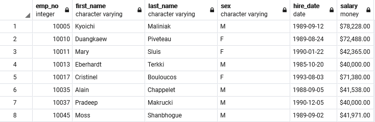
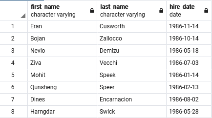
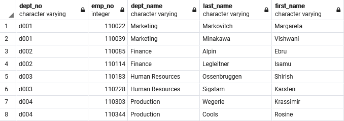
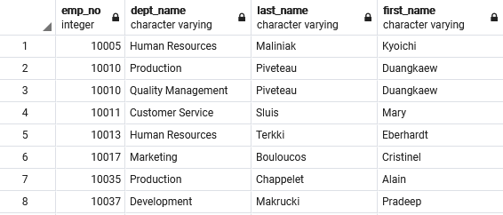
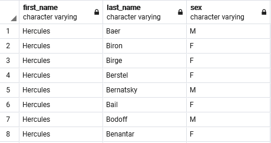
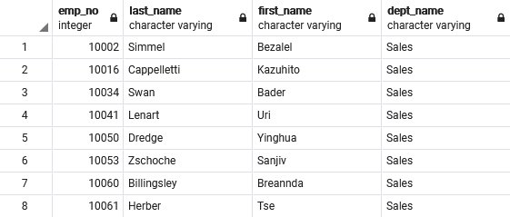
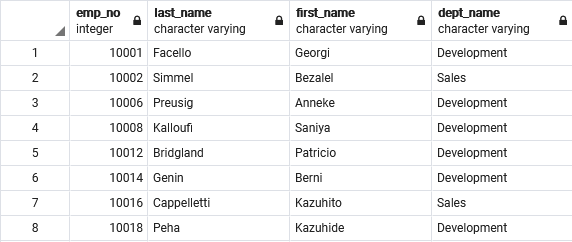
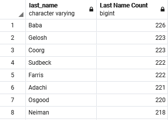

# SQL Homework - Employee Database: A Mystery in Two Parts

 [postgres logo](images/logoPostgresSQL.PNG)

## Background

In this assignment, I designed the tables to hold data in the CSVs, import the CSVs into a SQL database, and answer questions about the data through Data Engineering and Data Analysis. The data contains employees hired at "Pewlett Hackard" from the 1980s and 1990s which were stored in six CSV files.

#### Data Engineering

* Used the information to create a table schema for each of the six CSV files. 
* Imported each CSV file into the corresponding SQL table. 

* CSVs used: [Data Folder](https://github.com/Tam-ala/sql-challenge/blob/master/data)
* Tool used to sketch ERD: [Quick Database Diagrams](http://www.quickdatabasediagrams.com)
* Tool used to make queries: [Postgres](https://www.postgresql.org/)

#### Data Analysis

* Refer here to look at the ERD: [Employee ERD](images/Employee_ERD_Image.png)
* Refer here to look at Employee Schema and queries: [Employee Schema](Employee_Schema.sql) & [Employee Data Analysis](Employee_Data_Analysis.sql)
* A sample of the query results are displayed in the images below as well as [here](https://github.com/Tam-ala/sql-challenge/blob/master/images).

After creating the EmployeeSQL database, I did the following:

1. List the following details of each employee: employee number, last name, first name, sex, and salary.

The output displayed 300,024 employess based on this query.

2. List first name, last name, and hire date for employees who were hired in 1986.

There were 36,150 hired that year.

3. List the manager of each department with the following information: department number, department name, the manager's employee number, last name, first name.

There were a total of 24 managers.

4. List the department of each employee with the following information: employee number, last name, first name, and department name.

There were a total of 331,603 employees. This is a 31,579 increase compared to the first query. Meaning, that these employees were not included in the employee csv.

5. List first name, last name, and sex for employees whose first name is "Hercules" and last names begin with "B."

There were 20 employees with the last name Hercules.

6. List all employees in the Sales department, including their employee number, last name, first name, and department name.

During this time period, 52,245 employees were in the Sales departments.

7. List all employees in the Sales and Development departments, including their employee number, last name, first name, and department name.

During this time period, 137,952 employees were in the Sales and Development departments.

8. In descending order, list the frequency count of employee last names, i.e., how many employees share each last name.

From the 1638 last names in this database, the range of employess sharing that last name during this time period was from 145 to 226 employees except of one person. That one person's name is April Foolsday(Emp.# 499942) from the Development department.

